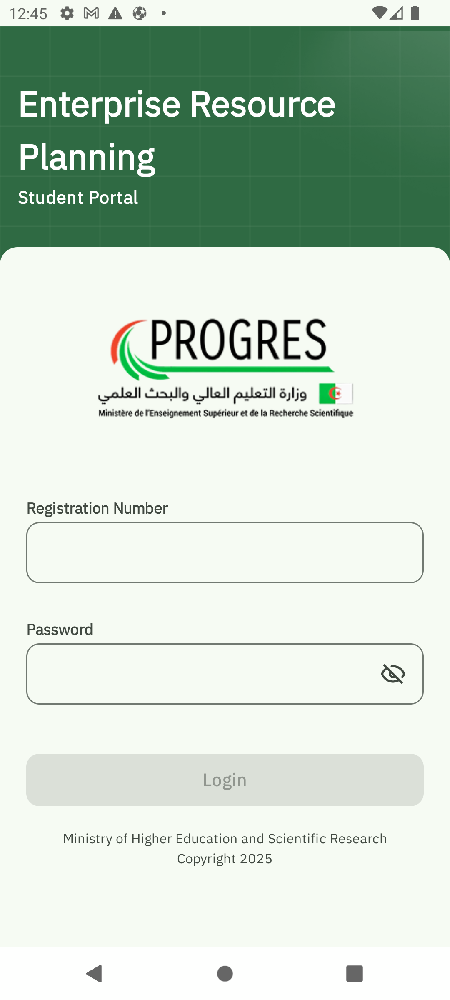

# WEBETU: Mobile Student Portal for Algerian Universities

## 🎓 Project Overview

WEBETU is an innovative mobile application designed to enhance the student experience in Algerian universities. This comprehensive student portal serves as a centralized platform, bringing together essential services and information crucial for student life.

## Images

## 🌟 Project Background

- **Origin**: Unofficial project developed independently
- **API Source**: API shared by the Progress Team during CodingMaster'2024
- **Design Team**: Carefully crafted by an exceptional team of five students:
    - Hadjer Ben
    - Abderaouf Benamirouche
    - Maria Bezzaz
    - Souad Tayebi
    - Sara Myriam Kerrouche

## 🚀 Technical Specifications

- **Platform**: Pure Android Project
- **Programming Language**: Kotlin
- **UI Framework**: Jetpack Compose
- **Architecture**: MVVM (Model-View-ViewModel)
- **Architectural Layers**:
    - Presentation Layer
    - Data Layer
    - Domain ( Model Layer )

## ℹ️ Purpose

The primary goal of WEBETU is to simplify and streamline the student experience by providing:
- Easy access to important university services
- Centralized information hub
- Tools to support academic and personal life

## 🤝 Contributing

We welcome contributions, especially from:
- Mid-Junior Developers
- Those familiar with the following technologies:
    - Kotlin
    - Android Development
    - Jetpack Compose
    - MVVM Architecture

## 📝 License

**Open Source Usage Guidelines**:
- Free for public usage
- Edits and modifications are allowed
- **STRICTLY PROHIBITED**: Commercial use without explicit permission from the project creators

## 👥 Contact

Connect with us on Instagram:
[Zakaria Bouchantouf's Instagram](https://www.instagram.com/bouchantoufzakaria/)

---

**Developed by Students, For Students** 🎉